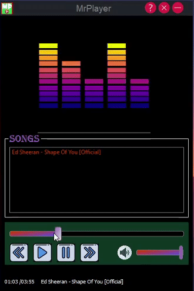

**MrPlayer** is a _MP3_ player made on 100% **Python**, it is for **Windows** .

Made by AkshatChauhan18
---

## Features of MrPlayer

**MrPlayer has all features -**

1. Play
2. Pause
3. Next
4. Previous
5. Help Button
6. Total duration and current duration
7. Duration slider
8. Volume slider

## How to use MrPlayer

When you will first time start MrPlayer it show nothing in the song box ,
to add songs close MrPlayer and go to your ***Music*** folder
and there will be a folder already created of name MrPlayer-songs , add songs
to the MrPlayer folder and rerun the app . Enjoy using MrPlayer. 
